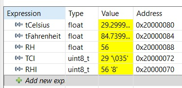
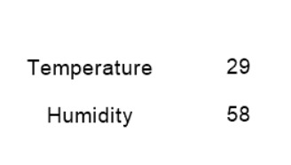

# Temperature-Monitoring-using-STM32-Nextion
## Introduction

This project is a real-time Temperature and Humidity Monitoring System developed using the STM32F103C8T6 microcontroller, DHT11 sensor, and Nextion. The system measures environmental conditions and displays temperature in both Celsius and Fahrenheit along with humidity values on the Nextion display.

## Components

* STM32F103C8T6 (Blue Pill)
* DHT11 Temperature & Humidity Sensor
* Nextion HMI Display
* Jumper Wires

## Method

The DHT11 sensor collects real-time temperature and humidity data and sends it to the STM32 microcontroller. The STM32 processes the sensor data and communicates with the Nextion display through UART communication. The output values are continuously updated and displayed on the HMI screen.

## Technologies Used

* Embedded C
* STM32 Microcontroller
* UART Communication
* Nextion GUI Development
* Sensor Interfacing

## Applications

* Smart Home Monitoring
* Environmental Monitoring
* Weather Monitoring Systems
* Industrial Automation
* IoT-based Monitoring Systems

## The Project Involved

* Interfacing DHT11 sensor with STM32
* Reading and processing sensor data
* Displaying temperature in Celsius and Fahrenheit
* Displaying humidity percentage
* UART communication between STM32 and Nextion display
* Real-time monitoring and GUI implementation
  
## Snaps of the Project

  
  
Live Expressions

  
  
Nextion Stimulation

<video width="700" controls>
  <source src="DHT11_Video.mp4" type="video/mp4">
</video>
  
Live Nextion Stimulation

